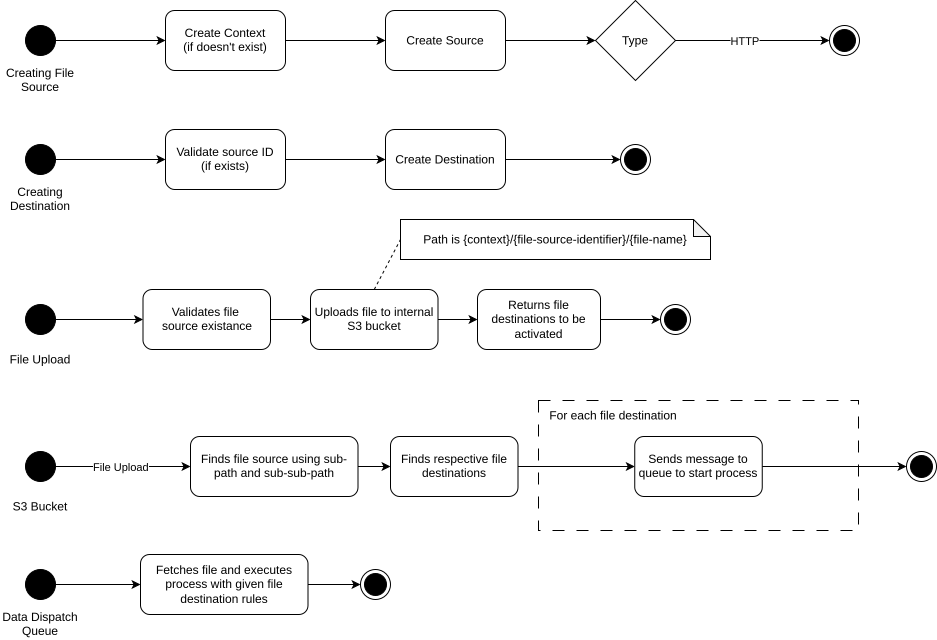

# CSVeer

CSVeer is a tool to configure automatic dispatching of the contents of CSV files to a single or multiple destinations.

Currently, it supports receiving CSV files via an API endpoint, and dispatching the content to an SQS queue, whilst applying grouping and batching rules.

## Stack
- Rust (Axum/SQLX)
- PostgreSQL

## Diagrams

#### Overview

